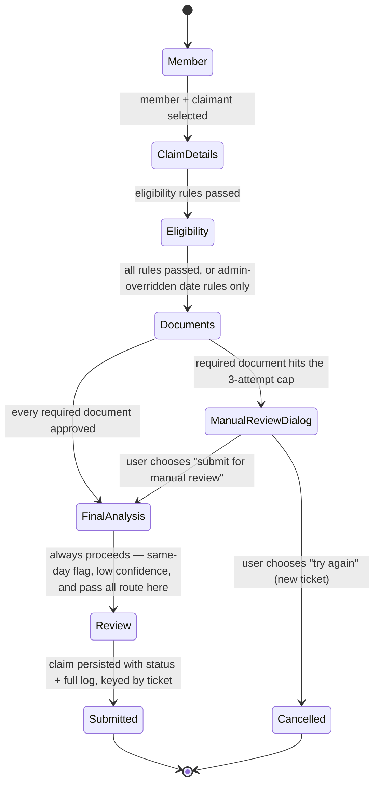

# Architecture

This document explains what was built, how the pieces interact, what alternatives were considered and rejected, where the current design breaks down, and specifically what would need to change to carry 10x the current load. It's meant to be read alongside `COMPONENT_CONTRACTS.md`, which defines the precise interface of each piece named here.

---

## 1. What this system does

A claims employee runs a member's reimbursement claim through a six-stage wizard: identify the member and beneficiary, enter claim details, run a deterministic eligibility check against policy rules, upload and AI-verify supporting documents, run a final claim-level confidence and fraud pass, then review and submit. The output is a claim record with a status (`APPROVED` / `REJECTED` / `UNDER_REVIEW` / `PENDING_REVIEW` / `FAILED` / `CANCELLED`), a payable amount, and a complete log of how the system arrived at that decision.

The system is split into two services with a deliberately narrow boundary between them:

- **Frontend (this repo):** owns the workflow, the policy/eligibility/fraud rules, the retry and circuit-breaker logic, the final confidence calculation, persistence, and the audit log.
- **Backend (FastAPI + LangGraph, separate repo):** owns exactly one thing — given a single document and the claim context, decide whether that document is valid, with a confidence score and reasoning.

Everything that's deterministic policy logic stays out of the LLM's hands. Everything that requires actually reading an image or PDF goes to it. That boundary is the central architectural decision in this system, and most of what follows is a consequence of it.

---

## 2. Components

| Component | File | Responsibility |
|---|---|---|
| Claim Wizard | `claim-wizard.tsx` | Orchestrates the six-stage flow; owns all wizard-session state; the only component that calls the others |
| Eligibility & Fraud Engine | `eligibility.ts` | Pure, deterministic policy evaluation — sub-limits, waiting periods, duplicate detection, same-day fraud signal, payable amount calculation |
| Document Verification Client | `doc-verify.ts` | Talks to the backend for a single document; owns the per-document decision thresholds |
| Final Analysis | inline in `claim-wizard.tsx` (`useMemo`) | Aggregates per-document confidence into one claim-level confidence; checks the fraud flag |
| Claims Store | `claims-store.ts` | Persistence boundary — the only module that touches `localStorage` directly |
| Claims Tracker | `claims-tracker.tsx` | Read surface for submitted claims, including their full activity log |
| Activity Log | `eventLog` state + `ClaimLogEntry[]` in `claims-store.ts` | Cross-cutting — every component logs through the same mechanism, attached to the claim record at submission |
| FastAPI + LangGraph service | separate repo | Owns document-level AI reasoning (OCR, extraction, PASS/FAIL + confidence) |

### Component interaction

```mermaid
flowchart TB
    subgraph Frontend["Frontend — React + TypeScript"]
        Wizard["Claim Wizard<br/>(stage-gated state machine)"]
        Elig["Eligibility & Fraud Engine<br/>eligibility.ts"]
        DocClient["Document Verification Client<br/>doc-verify.ts"]
        FA["Final Analysis<br/>(local confidence average)"]
        Log["Activity Log<br/>(eventLog)"]
        Store["Claims Store<br/>claims-store.ts"]
        Tracker["Claims Tracker UI"]

        Wizard --> Elig
        Wizard --> DocClient
        Wizard --> FA
        Wizard --> Log
        Wizard --> Store
        Elig --> Store
        Log --> Store
        Tracker --> Store
    end

    subgraph Backend["Backend — FastAPI + LangGraph (separate service)"]
        Endpoint["/process-claim"]
        Auth["API key check"]
        Graph["LangGraph workflow"]
        Disk[("Local file storage<br/>(uploaded documents)")]
        Endpoint --> Auth
        Auth --> Graph
        Graph --> Disk
    end

    DocClient -- "multipart/form-data<br/>+ X-API-Key" --> Endpoint
    Endpoint -- "&#123;status, data: DocumentValidator&#125;" --> DocClient
```

### Sequence: a single document upload, including the retry cap

```mermaid
sequenceDiagram
    participant User
    participant Wizard as Claim Wizard (React state)
    participant Client as doc-verify.ts
    participant API as FastAPI /process-claim
    participant LG as LangGraph

    User->>Wizard: select file for document type
    Wizard->>Wizard: check attempts < 3 and no in-flight request for this slot
    Wizard->>Client: verifyDocument(file, claim fields)
    Client->>API: POST multipart/form-data + X-API-Key
    API->>API: validate API key
    alt invalid or missing key
        API-->>Client: 401
        Client-->>Wizard: throws Error
        Wizard->>Wizard: attempts++, status = "error"
    else valid key
        API->>LG: compiled_graph.invoke(initial_state)
        LG-->>API: final_state (DocumentValidator)
        API-->>Client: &#123; status: "success", data: final_state &#125;
        Client-->>Wizard: ApiResponse
        Wizard->>Wizard: decideFromResult() -> APPROVED / FAILED / UNDER_REVIEW
        alt attempts == 3 and not APPROVED
            Wizard->>Wizard: status = "unprocessable"
            Wizard->>User: blocking dialog — manual review or restart
        end
    end
    Wizard->>Wizard: logEvent(stage="documents", detail=full LangGraph response)
```

### Wizard state machine, including the manual-review branch

---

## 3. Design decisions: what was considered and rejected

| Considered | Rejected because | What we did instead |
|---|---|---|
| Second LLM pass over the full document set, for claim-level confidence | Added cost and latency not justified at MVP scale; a flat average over already-computed per-document scores is free and directionally correct for a first version | Local cumulative average across approved documents, gated at 0.8, computed client-side with no network call |
| Hard-rejecting at the eligibility gate when same-day claim count exceeds the threshold | A same-day pattern is a behavioral signal, not proof of fraud — auto-rejecting a legitimate repeat claim (e.g. a family filing several claims the same day) is a worse failure mode than flagging it for a human | Same-day check is informational at eligibility; the consequence (routing to human review) is deferred to Final Analysis |
| Unlimited document retries | Lets a user, or a flaky upstream, consume unbounded LLM calls against the backend indefinitely | Hard 3-attempt cap enforced in wizard state (not just the UI), and it survives clear-and-reupload |
| Hashing or otherwise obscuring the API endpoint client-side | Doesn't achieve real security — anything shipped to a browser is inspectable; hashing a URL doesn't make it secret, it just relocates what's exposed | Shared API key header + endpoint via build-time env var, documented as "stops casual misuse," not as real secrecy |
| Server-side wizard session / state management | No multi-device or auth requirement at this stage — a stateful backend dependency would add infrastructure for no current benefit | Wizard state lives entirely client-side until one final, atomic write at submission |
| Letting the user keep uploading other documents after a required one becomes unprocessable | The claim's outcome is already determined at that point — letting someone keep working on the rest is wasted effort for both the user and the backend | A blocking dialog forces an explicit decision (manual review or restart) the moment a required document is exhausted |

---

## 4. Limitations of the current design

- **`localStorage` as the datastore.** No multi-device sync, no real durability guarantee, a same-origin browser storage ceiling (roughly 5–10MB depending on browser), data loss on cache clear, and no protection against a user editing their own stored claims via dev tools.
- **Synchronous, sequential document verification.** Each document is verified one at a time, blocking on a single LLM call chain per file. There's no parallelism across documents and no network-level timeout/backoff beyond the app's own 3-attempt cap.
- **No idempotency key on uploads.** If a request reaches the backend and LangGraph actually processes it, but the response is lost on the way back (timeout, dropped connection), the client has no way to know the backend already did the work — a retry will reprocess from scratch.
- **Retry cap is enforced client-side only.** Nothing stops a request sent directly to `/process-claim` (bypassing the wizard entirely) from being retried as many times as someone wants — the cap is a UX/cost control for the wizard, not a server-side rate limit.
- **No auth or per-user claim isolation.** Anyone with the API key can call the verification endpoint directly; there's no concept of "whose claim this is" beyond what's stored in the claim record itself.
- **`updateClaim` has no consumer.** It exists in `claims-store.ts` for an eventual reviewer/admin flow that would resolve `PENDING_REVIEW` / `UNDER_REVIEW` claims, but that surface doesn't exist yet.
- **Final Analysis is a flat average**, not a cross-document reasoning pass — covered in README §5.
- **Uploaded files are written to local disk** on the backend (`uploads/{filename}`), which doesn't survive a redeploy and doesn't work at all across multiple backend instances.

---

## 5. Scaling to 10x load

Each of the limitations above becomes the actual bottleneck at scale, not just a theoretical one. Here's what changes, concretely:

### Persistence
**Today:** `localStorage`, single browser tab, full `loadClaims()` reads everything into memory for every query.
**At 10x:** Move claim records to a real database (Postgres, given the data is relational — claims, documents, eligibility rules, with clear foreign keys). The frontend talks to a claims API instead of writing to storage directly, which also closes the "client can edit its own records" gap. The claims tracker's full-table `loadClaims()` becomes a paginated, indexed query (by user, by status, by date) instead of loading every claim that's ever existed.

### Document storage
**Today:** Saved to local disk on a single FastAPI instance.
**At 10x:** Object storage (S3 or equivalent) behind the backend, not local disk — required the moment there's more than one backend instance, since local disk isn't shared across them.

### Backend processing
**Today:** One synchronous request/response cycle per document, blocking on `compiled_graph.invoke()` for the full duration of the LLM call.
**At 10x:** Move LangGraph invocation off the request path into an async job queue (Celery/RQ/Cloud Tasks, with the API returning a job ID and the client polling or receiving a webhook). This decouples the number of concurrent verifications from the number of API server instances, lets LangGraph workers scale independently, and allows genuinely parallel verification of multiple documents in one claim instead of one-at-a-time.

### Idempotency & retries
**Today:** None — a retried request is processed from scratch.
**At 10x:** Client generates a UUID per upload attempt, sent as an idempotency key; the backend checks it before invoking the graph and returns the cached result for a duplicate key instead of reprocessing. This matters more as volume grows because retries become routine (timeouts, transient network failures) rather than rare.

### Abuse prevention
**Today:** The 3-attempt cap is enforced only in the wizard's client state.
**At 10x:** The same cap needs server-side enforcement — rate limiting per API key (or per claim/ticket ID) on `/process-claim`, independent of whatever the frontend does. A client-side-only cap is a UX feature, not a cost control, once the endpoint is reachable by more than one trusted frontend.

### Final Analysis
**Today:** Free, instant, local — and that property doesn't change at 10x, which is exactly why it's a reasonable MVP choice. If it's upgraded to the cross-document LangGraph pass described in README §5, that pass needs the same async-job treatment as per-document verification — it cannot become a second synchronous blocking call in the request path.

### Auth & multi-tenancy
**Today:** None.
**At 10x:** Real user accounts, claim ownership tied to a user/org, and role-based access for the reviewer/admin flow that `updateClaim` is already shaped for. This is also where the `PENDING_REVIEW` / `UNDER_REVIEW` distinction in the claim status starts paying for itself — it's already designed to support a review queue split by trigger reason, it just needs the UI built on top.

### Observability
**Today:** The activity log is per-claim, stored with the claim, and viewed one claim at a time.
**At 10x:** That's still useful as an audit trail, but it stops being enough for operating the system — need centralized structured logging/tracing (OpenTelemetry or equivalent) across the frontend, FastAPI, and LangGraph, correlated by ticket ID, so a systemic issue (e.g. a degraded LLM provider) is visible in aggregate, not just discoverable one flagged claim at a time.

### What doesn't need to change
The frontend itself is a static Vite build — it scales behind a CDN trivially and isn't a bottleneck at any realistic load. The deterministic eligibility/fraud rules engine is pure, synchronous, and cheap; it has no scaling concerns of its own.
