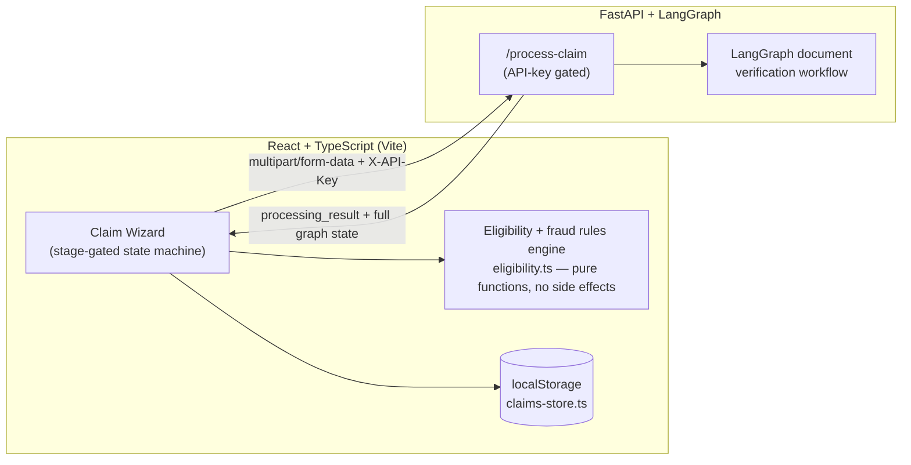

# Claim Wizard

AI-assisted health insurance claims processing — a guided, multi-stage wizard that takes a claim from member lookup through AI-verified document submission, fraud screening, confidence-based final adjudication, and a fully auditable activity log, all gated by deterministic, validated rules at every step.

- 🎥 [YouTube Architecture & Project Walkthrough](https://www.youtube.com/watch?v=qGBj17hSVvU)
- 🌐 [LangGraph Workflow Live Demo](https://insurance-langgraph-flow.onrender.com/)
- 📂 [LangGraph Workflow Repository](https://github.com/shubhamjain25/Insurance-Langgraph-Flow)

This README documents the system design and the reasoning behind it, not just the feature list.

## Documentation

- This file — overview, setup, environment configuration
- [`ARCHITECTURE.md`](./ARCHITECTURE.md) — components, diagrams, design decisions made and rejected, current limitations, and how the system would need to change at 10x load
- [`COMPONENT_CONTRACTS.md`](./COMPONENT_CONTRACTS.md) — precise input/output/error contracts for every significant component, detailed enough to reimplement any one of them without reading its source

## Getting Started

### Prerequisites
- Node.js 18+ and npm
- A running instance of the FastAPI + LangGraph verification backend, reachable at the URL you'll set in `VITE_API_URL` below. This repo is the frontend only — the backend is a separate service.

### Install & run

```bash
git clone <this-repo-url>
cd claim-wizard
npm install
cp .env.example .env   # then fill in real values — see Environment Variables below
npm run dev
```

The dev server runs on Vite's default port (`http://localhost:5173` unless your `vite.config` overrides it). The backend does not need to share an origin with it — CORS is handled on the backend side (see `ARCHITECTURE.md` §7 for the CORS/API-key setup expected there).

### Building for production

```bash
npm run build
npm run preview   # serves the production build locally to sanity-check it
```

## Environment Variables

This app talks to exactly one external service — the LangGraph document-verification API — and needs two environment variables to do it. Create a `.env` file in the project root (Vite reads it automatically; it's gitignored by default — never commit real values):

```bash
# .env
VITE_API_KEY=<your-api-key>
VITE_API_URL=http://localhost:8000
```

| Variable | Required | What it's for |
|---|---|---|
| `VITE_API_KEY` | Yes | Sent as the `X-API-Key` header on every request to the verification endpoint. Must match whatever the backend's `require_api_key` dependency checks against. |
| `VITE_API_URL` | Yes | Base URL of the FastAPI service, no trailing slash needed (`http://localhost:8000` for local dev, your deployed host's URL otherwise). The app appends the route itself (e.g. `/process-claim`). |

A few things worth knowing:
- Vite only exposes env vars prefixed `VITE_` to client code — anything without that prefix is invisible to the frontend by design, so don't drop the prefix if you rename these.
- **Restart the dev server after creating or editing `.env`** — Vite reads it once at startup, not on every request.
- These values get inlined into the built JS bundle. That keeps them out of the UI, but it is not real secrecy — see §7 below for the honest version of what this protects against and what it doesn't.

---

## 1. Architecture at a glance



The split is intentional: **document-level intelligence lives in LangGraph** (OCR, extraction, PASS/FAIL reasoning per file), while **claim-level business logic — eligibility, sub-limits, fraud thresholds, retry caps, and the final adjudication decision — lives entirely client-side as deterministic TypeScript**, not as another model call. The wizard only asks the LLM what it's actually good at (reading a document) and keeps everything else as auditable, debuggable, versioned code rather than opaque prompt behavior.

For an MVP, `localStorage` stands in for a real claims datastore. `claims-store.ts` is the only file that would need to change to swap it for a real backend (Postgres, DynamoDB, whatever) — every other module talks to it through `loadClaims()` / `saveClaim()` / `updateClaim()`, never directly.

---

## 2. Core design principle: deterministic, gated progression

The wizard is a strict state machine with six stages — Member, Claim Details, Eligibility, Documents, Final Analysis, Review — and exactly one rule governs movement between them: **a stage cannot be entered until the previous one has been explicitly validated and locked.**

```
locked: { member, claim, eligibility, documents, analysis, review }  // all booleans
current: StageId
```

Concretely:
- Stage 2 won't lock without the eligibility rules engine returning `passed: true`.
- Stage 3 won't lock if any rule still fails (the admin override is scoped to date-related rules only — it can't silently wave through a fraud or sub-limit failure).
- Stage 4 won't lock until every required document has a terminal decision.
- Once a stage is locked, its data is frozen for the rest of the session — the eligibility numbers shown at submission are exactly the numbers computed when the rules last ran, not recomputed live against a moving target.

This is deliberate, not incidental. For something adjudicating money against policy rules, "the system can't be in an ambiguous state" is a correctness property, not a nice-to-have. There's no path through this wizard where a claim reaches submission without every gate in front of it having been satisfied at the moment it was passed.

---

## 3. Document verification: a layered decision system, not a single yes/no

Each document is independently sent to the LangGraph workflow and comes back with a `processing_result` — a PASS/FAIL plus a confidence score and reasoning. That raw output is deliberately *not* trusted as a final verdict on its own; it's run through an explicit decision function:

```
FAIL && confidence >= 0.7  ->  FAILED        (user gets up to 3 attempts)
PASS && confidence >= 0.6  ->  APPROVED      (locked, terminal)
everything else            ->  UNDER_REVIEW  (human judgment call)
```

The thresholds are asymmetric on purpose: rejecting a real claim is a worse failure mode than asking a human to glance at an ambiguous one, so the bar to auto-fail is higher than the bar to auto-pass, and anything genuinely uncertain falls into a review bucket instead of being forced into either extreme.

**Retry caps as a circuit breaker, not a UI nicety.** Every document gets a hard cap of 3 verification attempts, enforced in the wizard's own state — not just by greying out a button:

- The cap survives clearing and re-uploading a different file — attempts persist across a clear, closing the obvious bypass of "fail, clear, re-upload, repeat forever."
- A double-click or a flaky retry can't silently double-fire a request — each upload is gated by an in-flight lock per document slot, plus a request-token check so a slow, superseded response can never clobber a newer one.
- When the cap is exhausted on a *required* document, the wizard doesn't quietly let the user keep working on the rest of the claim — the outcome is already a foregone conclusion at that point, so it interrupts immediately with an explicit decision: **submit for manual review, or cancel and restart with a new ticket.** Neither option can be dismissed silently.

---

## 4. Fraud detection is a separate signal from document confidence — deliberately

Same-day claim volume (a behavioral pattern) and document image quality (what the LLM actually scores) are unrelated signals, and conflating them would make both noisier. So the same-day check is:

- Computed once, early, during eligibility verification, and reused downstream rather than recomputed — it can't go stale mid-session because nothing is persisted to the claims store until final submission.
- **Informational at the eligibility gate, not a hard block.** A member's 3rd+ same-day claim doesn't get auto-rejected before they even reach the document stage — it's surfaced, and the *consequence* (routing to human review) is deferred to Final Analysis, where it's considered alongside everything else about the claim instead of short-circuiting the flow on its own.

---

## 5. Final Analysis: claim-level confidence (and the MVP trade-off, explicitly)

Once every required document is independently approved, the wizard computes one aggregate signal for the claim as a whole: the **mean confidence score across all approved documents**, gated at 0.8.

```
avg(doc confidences) >= 0.8  ->  approved
avg(doc confidences) <  0.8  ->  routed to human review
```

**This is a deliberate MVP simplification, not an oversight.** A cumulative average treats each document's confidence as independent, which it isn't — a hospital bill and a prescription that individually score well but contradict each other on dates or amounts would still average out fine under this scheme. The more rigorous version of this stage would feed the full document set — not just the scores, but the extracted structured data from each one — back into a second LangGraph workflow that reasons about the claim holistically: cross-checking consistency between documents, re-weighting low-confidence outliers instead of flatly averaging them in, and producing a genuinely claim-level confidence rather than a derived statistic over independent ones. That's the natural next iteration once the added LLM cost and latency are worth it for the use case. For an MVP, a deterministic, free, instant local calculation that's directionally correct was the right trade to make first — and it's a one-line swap to call out to that second workflow later without touching anything upstream of this stage.

---

## 6. Logging: every decision is reconstructable, not just the verdict

Every claim accumulates a chronological event log for the duration of the session — document attempts (including the **entire raw LangGraph response per attempt**, not just the confidence score acted on), the captured claim information (claimant, hospital, amount, category — what the person actually typed, separate from the AI's read on it), eligibility and fraud results, the Final Analysis outcome, and any manual-review or cancellation decision along with why.

That log is persisted as part of the claim record itself, keyed by ticket, so it survives the session rather than living only in memory. It's surfaced two ways:

- **Live, from any stage**, via an activity-log button on the ticket banner — you don't have to reach the end of the wizard to see what's happened so far.
- **After the fact, from the claims tracker**, via the same eye icon on each claim card — so a claim that gets routed to `PENDING_REVIEW` or `UNDER_REVIEW` has a complete, replayable record of exactly what each document came back with and why the system decided what it decided, available to whoever picks it up next.

The goal is that "why was this claim flagged" never requires re-running anything or guessing — the answer is already sitting in the log, attached to the ticket.

---

## 7. Security posture (honest version)

The LangGraph endpoint and a shared API key are configured via environment variables, not exposed as editable fields in the UI. Worth being precise about what that does and doesn't buy: it stops casual discovery and accidental misuse, which is a reasonable bar for an MVP's threat model. It is **not** secret-grade protection — anything shipped to a browser bundle is inspectable in dev tools by a sufficiently motivated person, so the real endpoint and key are visible to anyone who looks. If this needs to be genuinely hidden from end users rather than just out of the UI, the correct next step is a thin server-side proxy holding the real destination — which also removes the CORS configuration this currently depends on.

On the backend side, this expects a `CORSMiddleware` with `allow_headers` covering `X-API-Key` (custom headers trigger a preflight `OPTIONS` request that plain `multipart/form-data` doesn't), and a `require_api_key` dependency on `/process-claim` checking that header against the same key configured here.

---

## 8. Known limitations / explicit next steps

- **Persistence is `localStorage`**, an intentional MVP stand-in — `claims-store.ts` is the single seam where a real backend slots in.
- **`updateClaim` exists but has no consumer yet** — it's there for an eventual reviewer/admin surface that would pick up `PENDING_REVIEW` / `UNDER_REVIEW` claims and resolve them to a final disposition. That UI doesn't exist yet.
- **The Final Analysis confidence score is a flat average**, as discussed in §5 — the natural upgrade path is a second graph pass over the full document set rather than a derived statistic over independent scores.
- **No auth/RBAC** beyond the API key on the verification endpoint — fine for a single-tenant MVP, not for production multi-user use.

See `ARCHITECTURE.md` for the fuller breakdown of these, plus what specifically would need to change to handle 10x the current load.

---

## Tech stack

- **Frontend:** React + TypeScript (Vite), Tailwind, shadcn/ui
- **Backend:** FastAPI, LangGraph (document verification workflow)
- **Storage (MVP):** browser `localStorage`, keyed by claim ticket
